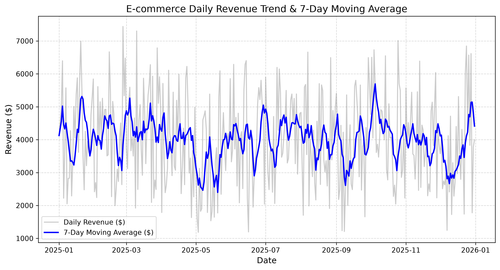

# E-commerce SQL Analytics & Sales Forecasting Setup

A data analytics and SQL project designed to analyze retail transaction data, model business metrics using Advanced SQL (CTEs, Window Functions), and output time-series aggregations for forecasting models.

## 📌 Project Overview
- **Database Engine:** SQLite
- **Languages & Libraries:** Python 3.13, Pandas, NumPy, Matplotlib, SQLite3
- **Data Architecture:** Star Schema (Dimension: `products`, Fact: `transactions`)

## 🛠️ Key Features & SQL Techniques Used
1. **Database Initialization (`setup_db.py`):**
   - Automated creation of relational database tables (`products` and `transactions`).
   - Generation of 1 year of synthetic daily e-commerce transactions.

2. **Advanced Analytics (`run_analysis.py`):**
   - **Time-Series Analysis:** Uses CTEs and Window Functions (`AVG() OVER`, `LAG()`) to compute:
     - Daily Revenue & Units Sold
     - 7-Day Rolling Moving Average for trend smoothing
     - Day-over-Day (DoD) Growth percentage
   - **Product Performance:** Relational `JOIN`s, `GROUP BY`, `HAVING`, and `DENSE_RANK()` window functions to rank categories by total generated revenue.

3. **Data Export & Visualization:**
   - Exported query deliverables to structured CSV datasets (`daily_sales_metrics.csv`, `category_performance.csv`).
   - Visualized daily revenue trends vs. rolling averages (`revenue_trend.png`).

## 📊 Visual Insights

## 🚀 How to Run

1. Clone the repository:
   git clone <your-repository-url>
   cd ecommerce-sql-forecasting

2. Activate Virtual Environment & Install dependencies:
   python3 -m venv venv
   source venv/bin/activate  # On macOS
   pip install pandas numpy matplotlib

3. Initialize Database:
   python setup_db.py

4. Execute SQL Queries and Generate Visuals:
   python run_analysis.py