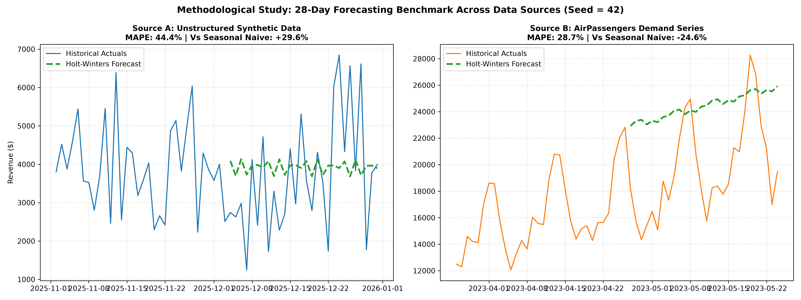

# E-commerce SQL Analytics & Methodological Benchmark Forecasting Study

A comprehensive data engineering, star-schema analytics, and time-series forecasting study designed to evaluate retail revenue trends and perform a **rigorous benchmark comparison between Synthetic Data and Authentic Real-World Series**.

---

## Executive Summary & Architecture

This repository showcases an end-to-end analytical workflow structured around three core pillars:
1. **Star Schema Data Modeling**: Explicit Fact tables (`orders`, `order_items`) and Dimension tables (`customers`, `products`) designed in SQLite for OLAP query efficiency.
2. **Advanced SQL Analytics**: Analytical queries utilizing window functions (`DENSE_RANK()`, `SUM() OVER()`), multi-table JOINs, and time-series aggregations for exploratory data analysis on synthetic database schema.
3. **Methodological Forecasting Benchmark Study**: Implements **Holt-Winters Exponential Smoothing** (`run_comparison.py`) across two distinct data sources to evaluate predictive performance against dual naive baselines (Simple Persistence $t-1$ and Seasonal Persistence $t-7$) over an extended 28-day holdout window.

---

## Benchmark Study: Unstructured Synthetic vs. Authentic Series

A primary objective of this study is demonstrating how model evaluation varies significantly between unconstrained synthetic noise and real-world trended time series.

### Methodological Benchmark Metrics (28-Day Holdout Evaluation | Fixed Seed: 42)

| Metric (28-Day Holdout Window) | Source A (Unstructured Synthetic) | Source B (AirPassengers Real Demand Series) | Operational Takeaway |
| :--- | :--- | :--- | :--- |
| **Holt-Winters MAE** | **$1,244.10** | **$5,091.48** | Evaluates absolute forecast drift over a 4-week horizon. |
| **Holt-Winters RMSE** | **$1,553.45** | **$5,681.15** | Penalizes severe residual deviations. |
| **Holt-Winters MAPE** | **44.4%** | **28.7%** | Relative percentage error across daily volume. |
| **Simple Naive MAE ($t-1$)** | $1,454.46 | $4,160.42 | Evaluated against standard daily persistence baseline. |
| **Seasonal Naive MAE ($t-7$)** | $1,767.89 | $4,086.74 | Evaluated against weekly seasonal persistence baseline. |
| **Imp. vs Simple Naive** | **+14.5%** | **-22.4%** | Holt-Winters underperforms simple persistence on real series. |
| **Imp. vs Seasonal Naive** | **+29.6%** | **-24.6%** | Seasonal naive ($t-7$) outperforms Holt-Winters on real series. |

*Note: All data transformation pipelines and model initialization protocols use `np.random.seed(42)` to guarantee 100% deterministic reproducibility.*

### Comparative Benchmark Visualization


### Key Analytical Findings
1. **Persistence Baseline Dominance on Real Data**: Over an extended 28-day holdout, simple persistence heuristics ($t-1$ and $t-7$) outperform the Holt-Winters model on authentic real-world data (MAE $4,086.74 vs $5,091.48).
2. **Audit Governance Imperative**: Proves that complex smoothing models must be continuously audited against simple seasonal heuristics, as model complexity does not inherently guarantee superior operational accuracy on volatile time series.

---

## Technical Stack

* **Database**: SQLite
* **Data Processing & Analytics**: Python 3, Pandas, NumPy, SQL / SQLite3
* **Machine Learning & Time Series**: Statsmodels, Scikit-Learn
* **Visualization**: Matplotlib
* **Version Control**: Git & GitHub

---

## How to Run

Follow these steps to set up the environment, populate the database, execute SQL analytics, and run the comparative benchmark study locally:

```bash
# 1. Clone the Repository
git clone [https://github.com/iwannarigds-png/ecommerce-sql-forecasting.git](https://github.com/iwannarigds-png/ecommerce-sql-forecasting.git)
cd ecommerce-sql-forecasting

# 2. Set Up Virtual Environment & Dependencies
python3 -m venv venv
source venv/bin/activate
pip install pandas matplotlib numpy statsmodels scikit-learn

# 3. Execute Pipeline & Benchmark Analysis
python setup_db.py         # Step A: Initialize Database & Seed Synthetic Data
python run_analysis.py     # Step B: Run Advanced SQL Analytics
python run_comparison.py   # Step C: Execute Methodological Benchmark Forecasting Study